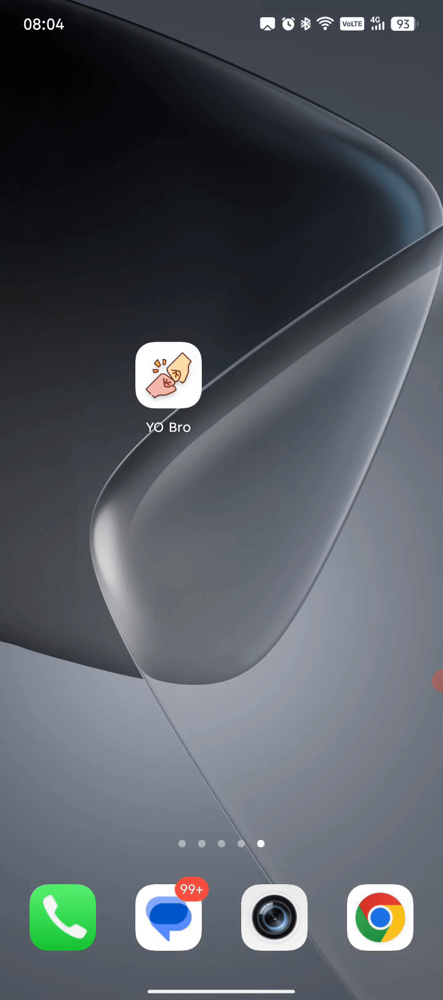

# Приложение «Yo Bro»

#### Авторский проект мобильного приложения, вдохновлённый сервисом из сериала «Кремниевая долина».

**Yo Bro** - это копия мобильного приложения из сериала "Кремниевая долина". Оно позволяет отправить пуш уведомление любому добавленному другу.
Приложение реализовано как гибридная PWA + Android-сборка и включает в себя полноценную работу с базой данных, push-уведомлениями, а также интеграцию с Firebase Cloud Functions.

## 📱 Скриншоты приложения

### ✉️ Отправка уведомления другу

| Отправка | Получение |
|---------|-----------|
|  |  |

---

### 🔔 Входящие уведомления

---

### 👤 Профиль пользователя

---

## 📌 Функциональность приложения

- Регистрация и авторизация пользователей
- Обновление профиля
- Поиск друзей и отправка запросов дружбы
- Отслеживание входящих запросов в реальном времени
- Push-уведомления через Firebase Cloud Messaging
- Список друзей
- Система Cloud Functions для обработки событий
- PWA-версия + возможность установки на устройство
- Сборка Android-приложения через Capacitor

---

## 🚀 Используемые технологии

### **Фронтенд**

- Vue 3 (Composition API)
- Quasar Framework
- Pinia
- Vue Router
- PWA

### **Backend & Realtime**

- Firebase Authentication
- Cloud Firestore
- Firebase Cloud Functions
- Firebase Storage
- Firebase Cloud Messaging

---

## 🔧 Дальнейшая доработка проекта

- Оптимизация структуры данных
- Улучшение системы уведомлений
- Добавление чата в реальном времени
- Добавление достижений
- Улучшение UX и анимаций
- Добавление тестирования

---

## 🌐 Ссылка на проект

- [Версия для просмотра в браузере](https://yo-bro.vercel.app/)
- [Скачать приложение для Android](https://disk.yandex.ru/d/nDwKn-hEG3WAYw)
